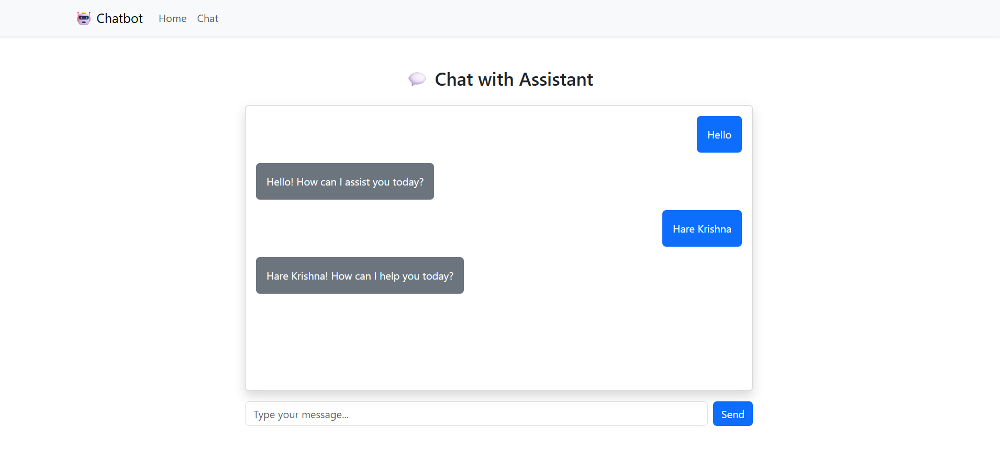

## 🌐 Frontend Preview




# ⚛️ Chatbot Suite – Frontend (React + Vite + Tailwind)

This is the **React-based frontend** of the fullstack Chatbot Suite app.

It connects to a FastAPI backend, sends user queries, and displays AI responses in a styled chat interface.

---

## 🌐 Live Dev Server

When running with Docker Compose, the frontend is served at:

```
http://localhost:5173
```

---

## 🔗 Backend Connection

- Requests are sent to: `http://localhost:7000/api/chatbot/chat`
- The request uses:
  - `POST` method
  - JSON payload: `{ "query": "your question here" }`
  - `credentials: include` to maintain the session via cookies

---

## 🛠️ Folder Structure

```
frontend/
├── src/
│   ├── components/     # Reusable components (e.g., ChatBox, Message)
│   ├── pages/          # Main chat page
│   ├── App.jsx         # App root
│   ├── index.css       # Tailwind styles
│   └── main.jsx        # Entry point
├── Dockerfile          # Dev server Docker image
├── index.html          # HTML shell
├── package.json        # NPM scripts and dependencies
├── postcss.config.js   # Tailwind/PostCSS setup
├── tailwind.config.js  # Tailwind customization
└── vite.config.js      # Vite settings
```

---

## 🐳 Running via Docker Compose

This frontend is included in the root `docker-compose.yml`:

```yaml
frontend:
  build:
    context: ./frontend
  command: npm run dev -- --host
  ports:
    - "5173:5173"
  develop:
    watch:
      - action: sync
        path: ./frontend
        target: /app
        ignore:
          - node_modules/
      - action: rebuild
        path: ./frontend/package.json
  environment:
    - NODE_ENV=development
```

> Hot-reload works with Vite + Docker using `develop.watch`

---

## ▶️ Start Frontend Locally (Dev Mode Without Docker)

If you're not using Docker, you can still run the frontend manually:

### 1. Install dependencies

```bash
cd frontend
npm install
```

### 2. Start dev server

```bash
npm run dev
```

Then open:

```
http://localhost:5173
```

> ⚠️ Make sure backend is running at `http://localhost:7000`

---

## 🧠 What Happens When You Type a Message?

1. Input text is added to the UI immediately (`from: "user"`)
2. Message is sent to backend via `fetch(...)`
3. Backend responds with assistant message
4. Bot reply is displayed (`from: "bot"`)

---

## ⚙️ Backend Request Sample

```js
const res = await fetch('http://localhost:7000/api/chatbot/chat', {
  method: 'POST',
  headers: { 'Content-Type': 'application/json' },
  credentials: 'include',
  body: JSON.stringify({ query: input })
});
```

---

## 🧪 Test in Browser Console

You can manually test with:

```js
fetch("http://localhost:7000/api/chatbot/chat", {
  method: "POST",
  headers: { "Content-Type": "application/json" },
  credentials: "include",
  body: JSON.stringify({ query: "Who is Krishna?" })
})
  .then(res => res.json())
  .then(data => console.log(data));
```

---

## ✨ Styling

- Built using [Tailwind CSS](https://tailwindcss.com/)
- Configured via `tailwind.config.js` and `postcss.config.js`

---

## 🧾 NPM Scripts

```bash
npm install     # install deps
npm run dev     # start Vite dev server
npm run build   # generate production build
```

---
